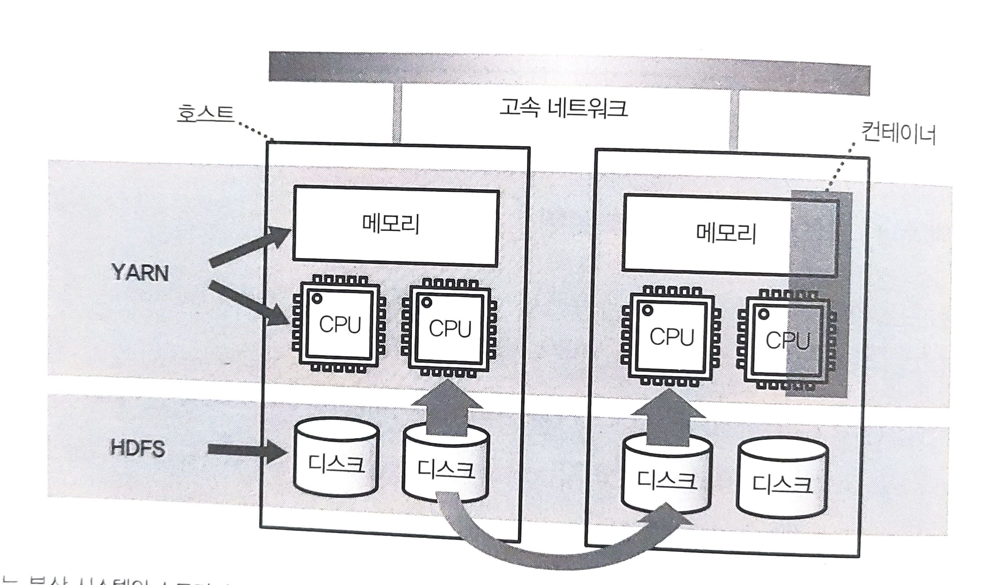

# 대규모 분산 처리의 프레임워크
## 구조화 데이터와 비구조화 데이터
SQL로 데이터를 집계하는 경우, 테이블의 칼럼 명과 데이터형, 테이블 간의 관계 등을 **스키마**로 정한다.  

스키마가 명확하게 정의된 데이터를 **구조화된 데이터(Structured Data)** 라고 한다.  

자연 언어로 작성된 텍스트 데이터와 이미지, 동영상 등의 미디어 데이터같은 스키마가 없는 데이터는 **비구조화 데이터(Unstructed Data)** 라고 한다.  

### 스키마리스 데이터
CSV, JSON, XML등의 데이터는 서식은 정해져 있지만, 칼럼 수나 데이터형은 명확하지 않아 **스키마리스 데이터** 라고 불린다.

### 데이터 구조화의 파이프라인
각 데이터 소스에서 수집된 비 구조화 데이터, 또는 스키마리스 데이터는 처음에는 분산 스토리지에 보존된다.  
분산 스토리지에 수집된 데이터는 명확한 스키마를 갖지 않는 것도 많으므로 그대로는 SQL로 집계할 수 없다. 따라서, 먼저 필요한 것은 스키마를 명확하게 한 테이블 형식의 *구조화 데이터*로 변환하는 것이다.  
> 여기서 구조화 데이터는 압축률을 높이기 위해 열 지향 스토리지에 저장한다고 가정한다.  

## Hadoop
Hadoop은 단일 소프트웨어가 아니라 분산 시스템을 구성하는 다수의 소프트웨어로 이루어진 집합체이다.
### 분산 시스템의 구성 요소
Hadoop의 기본 구성 요소는
- 분산 파일 시스템 : HDFS
- 리소스 관리자 : YARN
- 분산 데이터 처리 : MapReduce
이렇게 3가지이며, 그 외의 프로젝트는 hadoop qhscpdhksms ehrflqwjrdmfh roqkfehldjk Hadoop을 이용한 분산 애플리케이션으로 동작한다.  

### 분산 파일 시스템과 리소스 관리자
Hadoop에서 처리되는 데이터 대부분은 분산 파일 시스템인 HDFS에 저장된다.  
이것은 네트워크에 연결된 파일 서버와 같은 존재이지만, 다수의 컴퓨터에 파일을 복사하여 중복성을 높인다는 특징이 있다.  

한편, CPU나 메모리 등의 계산 리소스는 리소스 매니저인 YARN에 의해 관리된다. 
YARN은 애플리케이션이 사용하는 CPU 코어와 메모리를 **컨테이너**라 불리우는 단위로 관리한다. Hadoop에서 분산 애플리케이션을 실행하면 YARN이 클러스터 전체의 부하를 보고 비어 있는 호스트부터 컨테이너를 할당한다.  

### 분산 데이터 처리 및 쿼리 엔진
MapReduce도 YARN상에서 동작하는 분산 애플리케이션 중 하나이며, 분산 시스템에서 데이터 처리를 실행하는데 사용된다.  

SQL 등의 쿼리 언어에 의한 데이터 집계가 목적이라면 그것을 위해 설계된 쿼리 엔진을 사용해며 Apache Hive가 대표적인 엔진 중 하나이다.  

Hive는 MapReduce의 단점인 간단한 동작에서도 시간이 걸리는 점도 동일하다.

### Hive on Tez
Hive를 가속화하기 위해 Apache Tez를 개발했으며 MapReduce에 있던 몇 가지 단점을 해소함으로써 고속화를 실현하고있다.  

### 대화형 쿼리 엔진  
Hive를 고속화하는 것이 아니라 처음부터 대화형의 쿼리 실행만 전문으로 하는 쿼리 엔진도 개발되고 있는데 그중 대표적인 것들이 Apach Impala와 Presto이다.  

## Spark
Spark는 대량의 메모리를 활용하여 고속화를 실현한다.  

MapReduce나 Tez는 데이터 처리의 과정에서 만들어진 중간 데이터는 기본적으로 디스크로 기록하였다.  

그러나 Spakr는 **"가능한 한 많은 데이터를 메모리상에 올린 상태로 두어 디스크에는 아무것도 기록하지 않는다"** 는 선택을 했다.  

### MapReduce 대체하기  
Spark는 Hadoop을 대체하는 것이 아니라 MapReduce를 대체하는 존재다.  
> 예를 들어 분산 파일 시스템인 HDFS나 리소스 관리자인 YARN등은 Spark에서도 그대로 사용 할 수 있다.  

Spark의 실행은 자바 런타임이 필요하지만, Spark상에서 실행되는 데이터 처리는 스크립트 언어를 사용할 수 있다는 점도 매력적이다.  

