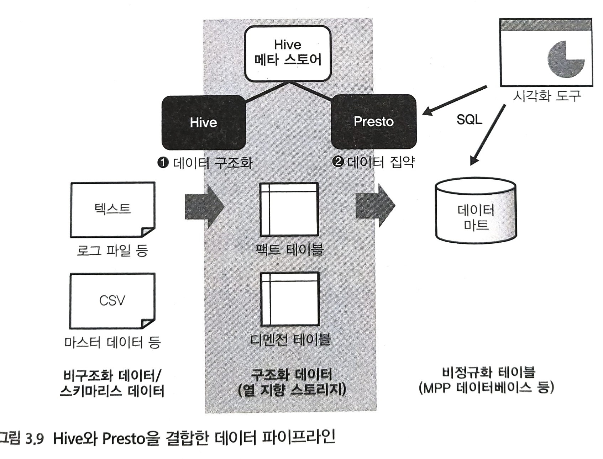

# 쿼리 엔진
## 데이터 마트 구축의 파이프라인

1. 처음에 분산 스토리지에 저장된 데이터를 구조화하고 열 지향 스토리지 형식으로 저장한다.
    - 이것은 다수의 텍스트 파일을 읽어 들여 가공하는 부하가 큰 처리가 되기 때문에 Hive를 이용한다.
2. 완성한 구조화 데이터를 결합, 집계하고 비정규화 테이블로 데이터 마트에 써서 보낸다.


## Hive에 의한 구조화 데이터 작성
1. Hive를 시작하고 `CREATE EXTERNAL TABLE`로 **외부 테이블(External Table)**을 정의한다.
```shell
$ hive

hive> CREATE EXTERNAL TABLE access_log_csv(
>     time string, request string, status int, bytes int
> )
> ROW FORMAT SERDE 'org.apache.hadoop.hive.serde2.OpenCSVSerde'
> STORED AS TEXTFILE LOCATION '/var/log/access_log'
> TBLPROPERTIES ('skip.header.line.count'='1');

OK
Time taken: 1.938 seconds
```
