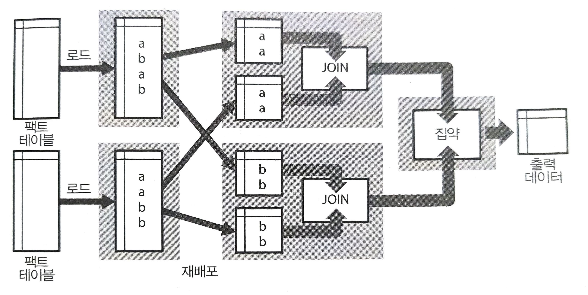
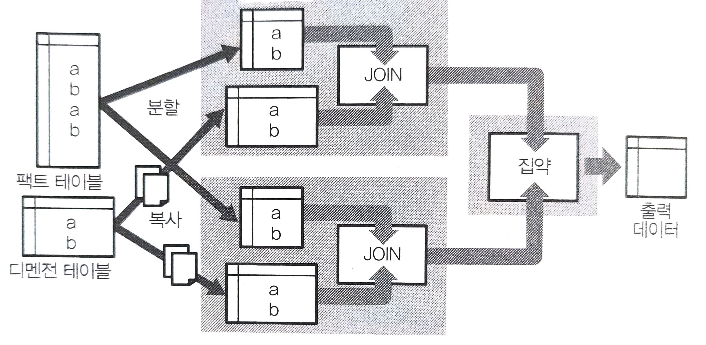

# 쿼리 엔진
## 데이터 마트 구축의 파이프라인

1. 처음에 분산 스토리지에 저장된 데이터를 구조화하고 열 지향 스토리지 형식으로 저장한다.
    - 이것은 다수의 텍스트 파일을 읽어 들여 가공하는 부하가 큰 처리가 되기 때문에 Hive를 이용한다.
2. 완성한 구조화 데이터를 결합, 집계하고 비정규화 테이블로 데이터 마트에 써서 보낸다.


## Hive에 의한 구조화 데이터 작성
### 예시 1
```shell
$ hive

1 hive> CREATE EXTERNAL TABLE access_log_csv(
  >     time string, request string, status int, bytes int
  > )
2 > ROW FORMAT SERDE 'org.apache.hadoop.hive.serde2.OpenCSVSerde'
3 > STORED AS TEXTFILE LOCATION '/var/log/access_log'
4 > TBLPROPERTIES ('skip.header.line.count'='1');

OK
Time taken: 1.938 seconds
```  

1. 외부 테이블 `access_log_csv`정의
    - 외부 테이블이란, Hive의 외부에 있는 특정 파일을 참고해 마치 거기에 테이블이 존재하는 것처럼 읽어 들이기 위해 지정하는 것이다.
2. CSV 형식임을 지정
3. 경로 지정
    - 디렉터리 내의 모든 파일 읽기
4. CSV의 헤더행 스킵

해당 예시는 `access_log_csv`라는 테이블명을 참고해 데이터를 추출함으로써 텍스트 파일이 로드되고 구조화 데이터로의 변환이 이루어진다.  

### 예시 2
Hive를 비롯한 대부분의 SQL-on-Hadoop의 쿼리 엔진은 MPP 데이터베이스처럼 데이터를 내부로 가져오지 않아도 텍스트 파일을 그대로 집계할 수 있다.  

```shell
hive> SELECT status, count(*) cnt
    > FROM access_log_csv GROUP BY status LIMIT 2;
...

OK
200     1701534
302     46573
Time taken: 8.664 seconds, Fetched: 2 row(s)

```
데이터를 그 자리에서 바로 집계할 수 있는 성질은 애드 혹 데이터를 분석하기에 유용하지만, CSV파일을 그대로 집계하는 것은 비효율적이므로 열 지향 스토리지로 변환해야한다.

### 예시 3 - 열 지향 스토리지로의 변환

```shell
hive> CREATE TABLE access_log_orc STORED AS ORC AS
    > SELECT cast(time AS timestamp) time,
    >        request,
    >        status,
    >        cast(bytes AS bigint) bytes
    > FROM access_log_csv;
OK
Time taken: 15.993 seconds


hive> SELECT status, count(*) cnt
    > FROM access_log_orc GROUP BY status LIMIT 2;
...
OK
200     1701534
302     46573
Time taken: 1.567 seconds, Fetched: 2 row(s)
```
Hive의 경우, 테이블마다 스토리지 형식을 지정할 수 있다.  
ORC 형식으로의 변환에는 시간이 걸리지만, 변환 후의 테입르 집계는 매우 빨라진다.  

원래 데이터가 텍스트이든 스키마리스 데이터이든 간에 그것이 Hive가 읽을 수 있는 형식이라면 무엇이든지 쿼리를 조금 고쳐 쓰는 것만으로도 어떤 테이블이라도 만들 수 있다.  

**이것이 Hive를 이용한 데이터 구조화 프로세스다.**  

### 서브 쿼리 안에서 레코드 수 줄이기
Hive는 데이터베이스가 아닌 데이터 처리를 위한 배치 처리 구조다.  
따라서, 읽어 들이는 데이터의 양을 의식하면서 쿼리를 작성하지 않으면 생각한 만큼의 성능이 나오지 않아 고민하게 된다.  

```SQL
SELECT ...
FROM access_log a
JOIN users b ON b.id = a.user_id
WHERE b.created_at = '2017-01-01'
```
위와 같이 작성하면 모든 데이터를 읽어 들인 후에 결합하고 이후에 나오는 WHERE에 의한 검색을 하게 된다.  
이렇게 되면 대량의 중간 데이터가 생성되고, 그 대부분을 그냥 버려 낭비가 되게 된다.  

```SQL
SELECT ...
-- 처음에 시간으로 팩트 테이블을 검색한다.
FROM (
    SELECT * access_log
    WHERE time >= TIMESTAMP '2017-01-01 00:00:00'
) a
JOIN users b ON b.id = a.user_id
WHERE b.created_at = '2017-01-01'
```  
위처럼 팩트 테이블을 작게 하는 것이 확실하다.  

Hive가 최적화 해주는 경우도 있어서, 서브 쿼리화가 꼭 필요한 것은 아니지만, 가능한 의식하여 **초기에 팩트 테이블을 작게 하는 것**이 빅데이터의 집계에서 중요하다.  


## 대화형 쿼리 엔진 Presto의 구조
Hive와 같은 배치형 쿼리 엔진은 대량 출력을 수반하는 대규모 데이터 처리에 적합하지만, 작은 쿼리를 여러 번 실행하는 대화형 데이터 처리에는 적합하지 않다.  
쿼리 실행의 지연을 감소시키는 것을 목적으로 갭라된 것이 **대화형 쿼리 엔진**이다.

대표적인 대화형 쿼리 엔진은 아래와 같다. 
- Dremel
- Google BigQuery
- Cloudera Impala (Apache Impala)
- Presto
- Apache Drill 1.0

### 플러그인 가능한 스토리지
Presto의 특징 중 하나인 **플러그인 가능한 스토리지 설계**는 전용 스토리지를 갖고 있지 않은 Presto의 특성상 Hive와 마찬가지로 다양한 데이터 소스에서 직접 데이터를 읽어 들인다.  

Presto는 특히 ORC 형식의 로드에 최적화되어있으며, 그것을 확장성이 높은 분산 스토리지에 배치하여 최대의 성능을 발휘한다.  

### CPU 처리의 최적화
Presto는 SQL의 실행에 특화된 시스템으로, 쿼리를 분석하여 최적의 실행 계획을 생성하고, 그것을 자바의 바이트 코드로 변환한다. 바이트 코드는 Presto의 워커 노드에 배포되고, 그것은 런타임 시스템에 의해 기계 코드로 컴파일된다.  

코드의 실행은 멀티 스레드화되어 단일 머신에서 수백 태스크나 병렬로 실행된다.  

### 인 메모리 처리에 의한 고속화
Hive와 달리 Presto는 쿼리의 실행 과정에서 디스크에 쓰기를 하지 않는다.  
모든 데이터 처리를 메로리상에서 실시하고 메모리가 부족하면 여유가 생길 때까지 기다리거나 오류로 실패한다.  

### 분산 결합과 브로드캐스트 결합
테이블의 결합은 종종 대량의 메모리를 소비한다. 특히 2개의 팩트 테이블을 결합하는 경우에는 매우 많은 조인 키를 메모리상에 계속 유지해야한다.  

Presto는 기본적으로 **분산 결합**을 사용하며, 같은 키를 갖는 데이터는 동일한 노드에 모인다.  


한쪽 테이블이 충분히 작은 경우에는 **브로드캐스트 결합(broadcast join)**을 사용하여 처리 속도를 크게 고속화할 수도 있다. 이 경우, 결합하는 테이블의 모든 데이터가 각 노드에 복사된다.  
  

### 열 지향 스토리지 집계
이와 같은 구조에 의헤 Presto에서는 열 지향 스토리지의 집계를 매우 빠르게 실행할 수 있다.  

> 실제로 ORC 형식의 테이블을 로드하면, 수백만 레코드 정도의 데이터양인 경우 1초 미만으로 집계할 수 있다.