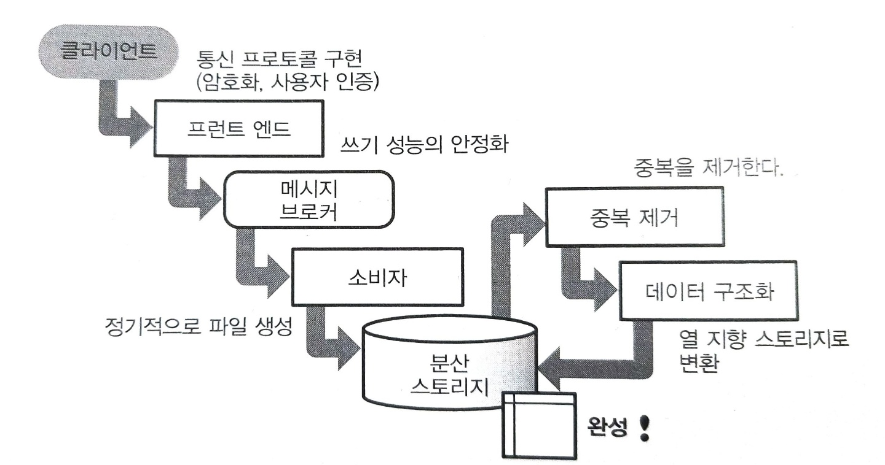

# 벌크 형과 스트리밍 형의 데이터 수집
데이터 전송에는 벌크 형과 스트리밍 형의 두 종류의 도구가 사용된다.

## 객체 스토리지와 데이터 수집
빅데이터는 대부분의 경우 확장성이 높은 **분산 스토리지(distributed storage)**에 저장된다.  
기본적으로 **객체 스토리지(object storage)**가 있다.
- Hadoop의 HDFS
- Amazon의 S3  

객체 스토리지에서의 파일 읽고 쓰기는 네트워크를 거쳐서 실행한다.  
데이터는 항상 여러 디스크에 복사되기 때문에 일부 하두웨어가 고장 나더라도 데이터가 손실되지 않는다.  

객체 스토리지의 구조는 데이터양이 많을 때는 우수하지만, 소량의 데이터에 대해서는 반대로 비효율적임에 주의가 필요하다.  

### 데이터 수집  
빅데이터는 주로 시계열 데이터를 다룬다.  
이런 데이터를 수시로 객체 스토리지에 기록하면 대량의 작은 파일이 생성되어 시간이 지남에 따라 성능을 저하시키는 요인이 된다.  

아래와 같이 데이터를 처리해 줘야 한다.
- 작은 데이터
  - 적당히 모아서 하나의 큰 파일로 만든다.
- 너무 큰 데이터
  - 적당히 나눠서 여러 파일로 만든다.  

빅데이터는 단지 수집만 해서는 안되고, 나중에 처리하기 쉽도록 준비해 둘 필요가 있다. 이렇게 수집한 데이터를 가공하여 집계 효율이 좋은 분산 스토리지를 만드는 일련의 프로세스를 **데이터 수집(data ingestion)**이라고 한다.  

## 벌크 형의 데이터 전송
원래 데이터가 처음부터 분산 스토리지에 저자오디어 있는 것이 아니라면 데이터 전송을 위한 **ETL 서버**를 설치한다.  

벌크 형의 도구로 파일 사이즈를 적정화하는 것은 비교적 간단하다. ETL 프로세스는 정기적인 실행을 하므로 그동안 축적된 데이터는 하나로 모인다.  
- 예를 들어 100개의 파일을 전송하는데 100번 전송을 반복하고 있다면 모아서 전송하는 것이 좋다.  
- 너무 큰 파일이라면 나눠서 전송하자  

데이터 전송의 신뢰성이 중요한 경우에는 가능한 한 벌크 형 도구를 사용해야 한다.
- 스트리밍 형의 데이터 전송은 나중에 재실행하기가 쉽지 않다.  
- 뭔가 문제가 발생했을 때 여러 번 데이터 전송을 재실행할 수 있다는 점이 벌크 형의 장점이다.  

## 스트리밍 형의 데이터 전송
지금 바로 생성되어 오는 데이터는 그자리에서 바로 전송하는 수 밖에 없다.  
그러한 데이터 전송의 공통점은 다수의 클라이언트에서 계속해서 작은 데이터가 전송 되는 것이다.
- 이러한 데이터 전송 방식을 일반적으로 **메세지 배송(message delivery)**라고 한다.  
- 메세지 배송 시스템은 전소오디는 데이터양에 비해 통신을 위한 오버헤드가 커지기 때문에 이를 처리하는 서버는 높은 성능을 요구한다.  

보내온 메세지를 저장하는 데에는 몇 가지 방법이 있다.
- NoSQL 데이터베이스 사용
  - 이 경우 Hive와 같은 쿼리 엔진으로 NoSQL 데이터베이스에 연결해 데이터를 읽을 수 있다.
- 메세지 큐, 메세지 브로커 등의 중계 시스템에 전송
  - 이 경우 기록된 데이터는 일정한 간격으로 꺼내고 모아서 함께 분산 스토리지에 저장한다.

### 웹 브라우저에서의 메세지 배송
자체 개발한 웹 어플리케이션에서는 웹 서버 안에서 메세지를 만들어 배송한다.
- 이때 전송 효율을 높이기 위해 서버상에서 일단 데이터를 축적해 놓고 나중에 모아서 보내는 경우가 많다.  

다른 방법으로는 자바스크립트를 사용하여 웹 브라우저에서 직접 메세지를 보내는 경우도 있다.
- 이것은 **웹 이벤트 추적(web evenet tracking)**이라고 한다.  

### 모바일 앱으로부터의 메세지 배송
모바일 앱은 통신 방법만 보면 HTTP 프로토콜을 사용하는 클라이언트 중 하나이므로 메세지 배송 방식이 웹 브라우저와 동일하다.  
- 서버를 직접 마련하는 것이 아니라 MBaaS(Mobile Backend as a Service)라는 백 엔드의 각종 서비스를 이용할 수 도 있다.  
- 또는 모바일 엡에 특화된 액세스 해석 서비스를 톻애 이벤트 데이터를 수집한다.
  - 이 경우 서비스에서 제공되는 모바일 용의 편리한 개발 키트를 사용하여 메세지를 보낸다.  

## 중복 제거는 높은 비용의 오퍼레이션
메세지의 중복을 제거하려면 같은 메세를 과거에 받은 것인지에 대한 여부를 판정해야 한다.
- 모든 메세지에 일련의 번호를 넣으려면 어딘가의 한 부분에 처리를 집중시킬 필요가 있다.

### 오프셋을 이용한 중복 제거
1. 전송해야 할 데이터에 파일명 등의 이름을 부여해 그것을 작은 메세지에 실어서 배송한다.
2. 각 메세지에는 파일 안의 시작 위치(오프셋)을 붙인다

만일 메세지가 중복되어도 같은 파일의 같은 장소를 덮어쓸 뿐이므로 문제되지 않는다.  
이 방법은 벌크 형의 데이터 전송과 같이 데이터양이 고정된 경우에는 잘 작동한다.

### 고유 ID에 의한 중복 제거
스트리밍 형의 메세지 배송에서 자수 사용되는 것은 모든 메세지에 **UUID(Universally Unique IDentifier)** 등의 고유 ID를 지정하는 방법이다.  
- 이 경우 메세지가 늘어남에 따라 ID가 폭발적으로 증가하므로 이것을 어떻게 관리하느냐가 문제다.
- 과거에 전송된 모든 ID를 기억하는 것은 비현실적이다.
- ID를 파기하면 늦게 도착한 메세지가 중복된다.

현실적으로는 최근에 받은 ID만을 기억해두고, 그보다 늦게 온 메세지의 중복은 허용한다.  

### 종단간(end to end)의 신뢰성
빅데이터의 메세지 배송에서는 종종 신뢰보다 효율쪽이 증시된다.  
- 따라서 중간 경로에 at least once를 보장하는 한편, 중복 제거는 하지 않는 것이 표준적인 구현이다.

### 고유 ID를 사용한 중복 제거의 방법
1. 분산 스토리지로 NoSQL 데이터베이스를 용한다.
  - Cassandra와 Elasticsearch 등은 그 특성상 데이터를 쓸 때 고유 ID를 지정하게 되어 있어 동일한 ID의 데이터는 덮어쓴다.
2. SQL로 중복을 제거한다.
  - 보내온 데이터는 일단 그대로 객체 스토리지 등에 저장해 놓고 나중에 읽어 들이는 단계에서 중복을 제거한다.
  - 대규모 데이터 처리이므로 메모리에서 실행하는 것은 거의 불가능하며, Hive 같은 배치형 쿼리 엔진에서 실행한다.

## 데이터 수집의 파이프라인

