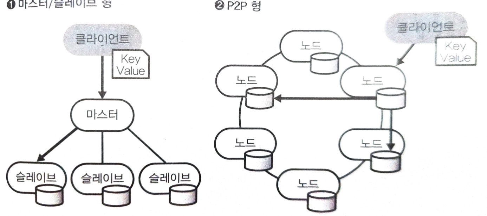

# 비구조화 데이터의 분산 스토리지
## NoSQL 데이터베이스에 의한 데이터 활용
빅데이터를 위한 분산 스토리지에는 필요에 따라 얼마든지 확장할 수 있는 확장성과 데이터를 구조화하지 않고도 저장할 수 있는 유연성이 요구된다.  
- 그중에서도 기본이 되는 객체 스토리지는 임의의 파일을 저장할 수 있다는 점이 장점이다.  

하지만 단점도 많다.
1. 객체 스토리지 상의 파일은 교체하기 어렵다.  
  - 일단 파일을 써넣으면 그것을 통째로 교체하는 방법밖에 없다.  
  - 쓰기 빈도가 높은 데이터는 별도의 RDB에 저장하고 정기적으로 스냅샷을 하거나 다른 **분산 데이터베이스**에 저장하도록 한다.  

2. 객체 스토리지에 저장된 데이터를 집계할 수 있게 되기까지의 시간이 걸린다.
  - 데이터를 기록하고 곧바로 활용하고자 하는 경우에는 실시간 집계와 검색에 적합한 데이터 저장소가 필요하다.
  - 특정 용도에 최적화된 데이터 장소를 일컬어 **NoSQL 데이터베이스**라는 말이 자주 사용된다.

## 분산 KVS
**분산 KVS(distributed Key-Value Store)**는 모든 데이터를 키값 쌍으로 저장하도록 설계된 데이터 저장소를 말한다.    

분산 KVS는 모든 데이터에 고유의 키를 지정하고 그것을 부하 분산을 위해 이용한다.  
- 키가 정해지면 그 값을 클러스터 내의 어느 노드에 배칠할 것인지 결정된다.  

  

### Amazon DynamoDB
DynamoDB는 항상 안정된 읽기 쓰기 성능을 제공하도록 디자인된 분산형 NoSQL 데이터베이스로 하나 또는 두 개의 키에 연결하는 형태로 임의의 스키마리스 데이터를 저장할 수 있다.   

DynamoDB는 P2P형의 분산 아키텍처를 갖고 있으며, 미리 설정한 초 단위의 요청수에 따라 노드가 증감되는 특징이 있다.  
- 따라서, 데이터의 읽기 및 쓰기에 지연이 발생하면 곤란한 애플리케이션에 유용하다