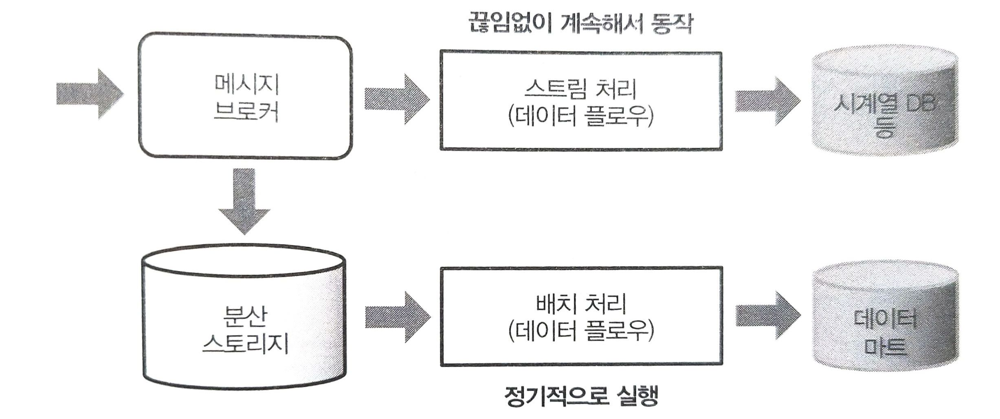

# 스트리밍 형의 데이터 플로우

## 매치 처리와 스트림 처리로 경로 나누기
배치 처리를 중심으로 하는 데이터 파이프라인의 결점은 데이터가 분석할 수 있게 될 때까지 시간이 걸린다는 것이다.  
집계 효율을 높이기 위해 열 지향 스토리지를 만들려고 하면, 데이터를 모아서 변환하는 데 아무래도 일정 시간이 필요하다.  

보다 실시간에 가까운 데이터 처리에서는 그러한 과정을 모두 생략한 별개의 계통으로 파이프라인을 만든다.  
- 여기서 말하는 실시간이란 대체로 이벤트 발생에서 몇 초 후에는 결과를 알 수 있는 것을 가리킨다.  

실시간성이 높은 데이터 처리 시스템의 예
- 시스템 모니터링
  - 서버와 네트워크의 상태를 감시
  - 시간 추이를 그래프로 표시
- 로그 관리 시스템
  - 운영체제의 시스템 이벤트나 로그 파일을 검색하여 비정상적인 상태라면 경고 발생
- 복합 이벤트 처리
  - 다수의 업무 시스템으로부터 보내온 이벤트 데이터를 자동으로 처리  

배치 처리에서는 도달한 데이터를 우선 분산 스토리지에 보관하고, 그것을 정기적으로 추출함으로써 데이터 처리를 한다.  
데이터가 영속적으로 보존되기 때문에 몇 번이고 재실행할 수 있다.  
장기적인 데이터 분석을 예상하여 집계 효율이 높은 열 지향 스토리지를 구축할 수 있다.  

스트림 처리에서는 데이터가 도달하는 것과 거의 동시에 처리가 시작된다.  
처리 내용은 미리 정해 둘 필요가 있으며, 과거로 거슬러 올라가 재실시 하는 것은 고려하지 않는다.  
처리한 결과는 시계열 데이터에 적합한 데이터 스토어에 보관하거나, 기존 실시간 시스템에 전송한다.  

