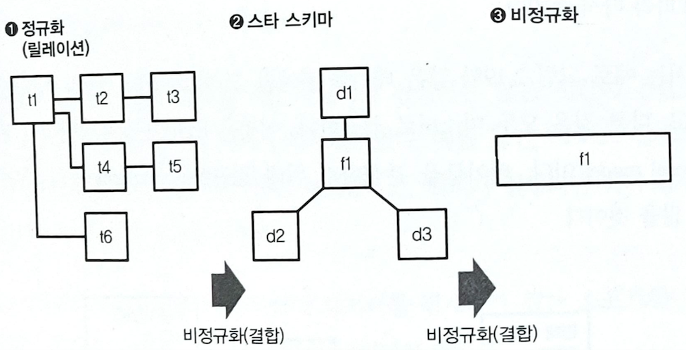

# 데이터 마트의 기본 구조
## 시각화에 적합한 데이터 마트 OLAP
BI도구에 있어서 핵심적인 개념 중 하나로 **OLAP(Online Analytical Processing)** 라는 구조가 있다.  

### 다차원 모델과 OLAP 큐브
OLAP은 데이터 집계를 효율화 하는 접근 방법 중의 하나다.  

RDB는 표 형식으로 모델링된 데이터를 SQL로 집계하지만, OLAP에서는 **다차원 모델**의 데이터 구조를 **MDX(Multidimensitional Expression)**등의 쿼리 언어로 집계한다. 데이터 분석을 위해 만들어진 다차원 데이터를 **OLAP 큐브**라고 부르며, 그것을 크로스 집계하는 구조가 OLAP이다.  

### MPP 데이터베이스와 비정규화 테이블
최근에는 MPP 데이터베이스와 인 메모리 데이터베이스 등의 보급으로 사전에 계산해 둘 필요가 없어져 OLAP 큐브를 위해 특별한 구조를 준비하는 것이 아니라, BI 도구와 MPP 데이터베이스를 조합하여 크로스 집계하는 경우가 증가하고있다.  

MPP 데이터베이스는 다차원 모델의 개념은 없기 때문에 이를 대신해 **비정규화 테이블**을 준비한다.  

## 테이블을 비정규화 하기
데이터베이스의 설계에서 종종 테이블을 `마스터`와 `트랜잭션`으로 구분한다.  
시간과 함께 생성되는 데이터를 기록한 것이 **트랜잭션**이며, 트랜잭션에서 참고되는 각종 정보가 **마스터**다. 트랜잭션은 한 번 기록되면 변화하지 않지만, 마스터는 상황에 따라 다시 쓰인다.  

### 팩트 테이블과 디멘전 테이블
데이터 웨어하우스에서는 트랜잭션처럼 사실이 기록된 것을 **팩트 테이블**이라고 하고, 거기에서 참고되는 마스터 데이터등을 **디멘전 테이블**이라고 한다.  

### 스타 스키마와 비정규화  

데이터 마트를 만들 때는 팩트 테이블을 중심으로 여러 디멘전 테이블을 결합하는 것이 좋다.  

그림으로 그리면 별 모양이 되므로, 이를 **스타 스키마** 라고 부른다.  

이러한 과정은 정규화와는 반대의 작업(데이터가 중복됨)을 하므로 이를 **비정규화(Demormalization)**라고도 한다.  

데이터 마트에서 스타 스키마가 사용되는 데는 두 가지 이유가 있다.
1. 단순하기 때문에 이해하기 쉽고, 데이터 분석을 쉽게 할 수 잇다.
2. 성능상의 이유로, 팩트 테이블에는 ID와 같은 키만을 남겨두고 그 외의 나머지는 디멘전 테이블로 옮긴다.  

